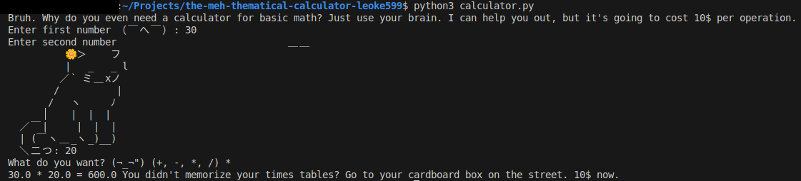

# Rude Calculator
A simple command-line calculator program with a twist. It's not your typical calculator; it prints out rude messages in almost every interaction.

## Features
- Addition, subtraction, multiplication, and division
- Rude commentary for each interaction

## Installation
1. Make sure you have [Python 3](https://www.python.org/downloads/) installed.
2. Clone this repository or download the source file.
3. Open the project in your IDE or run it from the terminal.

## Usage
Run the script in your terminal:
```bash
python calculator.py
```
or if you're on Linux / macOS
```bash
python3 calculator.py
```
## Example
